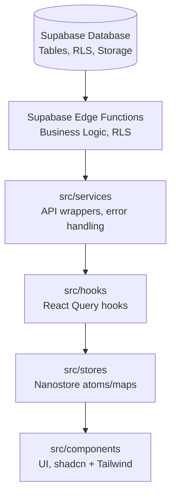

# 🔄 Data Flow: React + Supabase Project

This diagram shows how data flows through the stack:

---

## 🔑 Flow Explanation

1. **Database (Supabase)**  
   - Source of truth for all persistent data.  
   - Protected by **RLS policies**.  
   - Storage buckets for files.  

2. **Edge Functions**  
   - Contain **business logic** (validation, transformations, secure operations).  
   - Enforce **auth** and **policies**.  
   - Return typed responses (`types.ts`).  

3. **Services (`src/services/`)**  
   - Wrap Supabase client or Edge Function calls.  
   - Normalize errors.  
   - Provide a clean API for hooks.  

4. **Hooks (`src/hooks/` or `src/features/*/hooks/`)**  
   - Use **React Query** to fetch/mutate data.  
   - Encapsulate caching, loading, and error states.  
   - Expose typed data to components.  

5. **Stores (`src/stores/`)**  
   - Manage **client-only state** (UI state, preferences, selections).  
   - Use **Nanostore** for global state.  

6. **Components (`src/components/`)**  
   - Consume hooks + stores.  
   - Styled with **shadcn/ui + Tailwind**.  
   - No business logic — only presentation + interaction.
