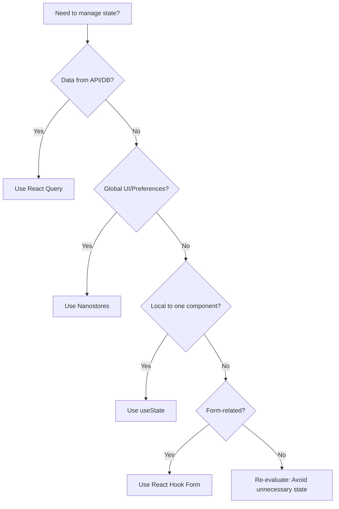

# 📦 State Management Conventions

These rules define how state must be managed in React applications.  
They are **mandatory** for all code written by humans or AI agents.  
The goal is **clarity, separation of concerns, and maintainability**.

---

## 1. State Categories

State in React apps falls into **four categories**:

1. **Server State** → Data fetched from APIs or databases (remote, async, cacheable).  
2. **Client/Global State** → UI state or preferences shared across components.  
3. **Local/Component State** → State that belongs only to a single component.  
4. **Form State** → State for handling form inputs, validation, and submission.

---

## 2. Server State (React Query)

- **Rule**: Use **React Query (TanStack Query)** for all server state.  
- **Rationale**: Handles caching, background updates, retries, and deduplication.  
- **Never** use `useState` or `useEffect` for server data.  

**Preferred:**

```ts
const useUserProfile = (id: string) =>
  useQuery({
    queryKey: ['user', id],
    queryFn: () => fetchUserProfile(id),
    staleTime: 5 * 60 * 1000, // 5 minutes
  });
```

**Avoid:**

```ts
const [user, setUser] = useState<User | null>(null);
useEffect(() => {
  fetchUserProfile(id).then(setUser);
}, [id]);
```

---

## 3. Client/Global State (Nanostores)

- **Rule**: Use **Nanostores** for global UI state and preferences.  
- **Rationale**: Lightweight, reactive, and avoids React Context boilerplate.  
- **Never** use React Context for simple global state.  

**Preferred:**

```ts
import { atom } from 'nanostores';

export const $theme = atom<'light' | 'dark'>('light');
export const $isSidebarOpen = atom(false);
```

---

## 4. Local/Component State (`useState`)

- **Rule**: Use `useState` for state that belongs only to a single component.  
- **Rationale**: Keeps local state simple and isolated.  
- **Never** lift local state into global state unless it’s shared.  

**Preferred:**

```tsx
const Counter = () => {
  const [count, setCount] = useState(0);
  return <button onClick={() => setCount(count + 1)}>{count}</button>;
};
```

---

## 5. Form State (React Hook Form)

- **Rule**: Use **React Hook Form** for complex forms.  
- **Rationale**: Handles validation, performance, and controlled/uncontrolled inputs.  
- **Never** use `useState` for every input in large forms.  

**Preferred:**

```tsx
const { register, handleSubmit } = useForm<{ email: string }>();

return (
  <form onSubmit={handleSubmit(console.log)}>
    <input {...register('email', { required: true })} />
    <button type="submit">Submit</button>
  </form>
);
```

---

## 6. Integration Patterns

- **Keep server and client state separate**.  
- **Use derived state** instead of duplicating.  
- **Never** store server data in Nanostores.  
- **Never** use React Query for purely client-side state.  

---

## 7. Decision Tree for AI Agent

When deciding **which state tool to use**, follow this:



---

## 8. Common Mistakes to Avoid

- ❌ Fetching data with `useEffect` + `useState` → ✅ Use React Query.  
- ❌ Using React Context for global UI state → ✅ Use Nanostores.  
- ❌ Storing server data in Nanostores → ✅ Keep it in React Query.  
- ❌ Using `useState` for every form input → ✅ Use React Hook Form.  
- ❌ Duplicating state in multiple stores → ✅ Use derived state.  

---

# ✅ Summary

- **Server state** → React Query (never use `useState`/`useEffect` for API calls).  
- **Client/global state** → Nanostores (never use React Context for simple state).  
- **Local state** → `useState` (keep it isolated).  
- **Form state** → React Hook Form (use `useState` only for trivial forms).  
- **Integration** → Keep server and client state separate, use derived state, avoid duplication.  
- **AI Agent Rule**: Always follow the decision tree and avoid common mistakes.
