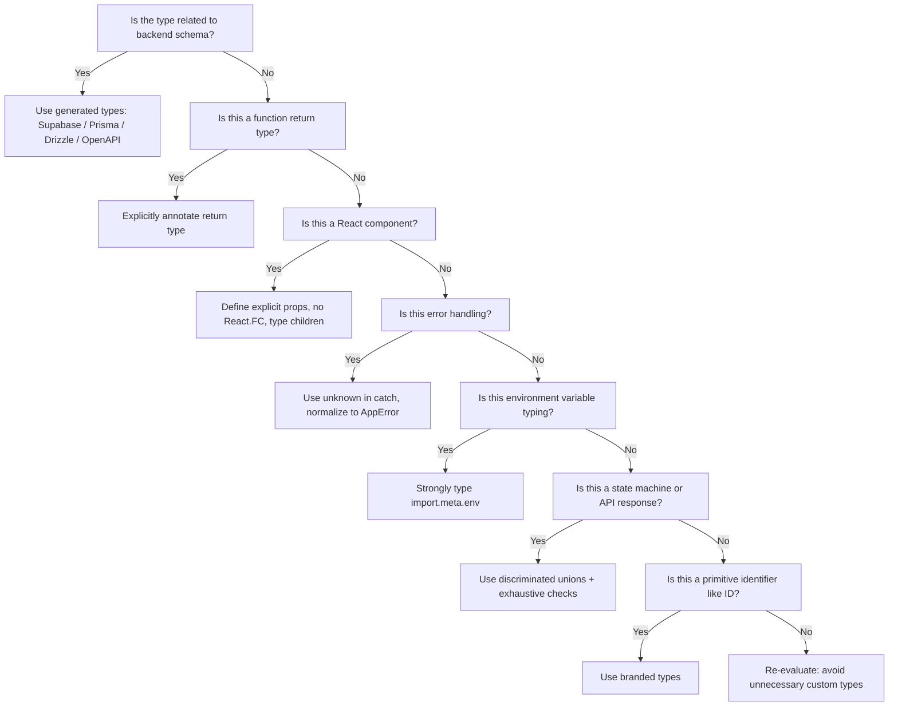

# 📘 TypeScript Conventions

These rules define how TypeScript must be used in this project.  
They are **mandatory** for all code written by humans or AI agents.  
The goal is **type safety, consistency, and maintainability**.

---

## 1. General Rules

- **Rule 1.1**: Always use **TypeScript strict mode** (`"strict": true` in `tsconfig.json`).  
- **Rule 1.2**: Never use `any`. Use `unknown`, `never`, or proper types.  
- **Rule 1.3**: Always prefer `type` over `interface` unless declaration merging is required.  
- **Rule 1.4**: Always explicitly type **public functions**, **async functions**, and **APIs**.  
- **Rule 1.5**: Use **PascalCase** for types and **camelCase** for variables/functions.  

---

## 2. Type Definitions

### 2.1 Prefer `type` over `interface`
- **Rationale**: `type` is more flexible (supports unions, intersections, utility types).  
- **Preferred**:
```ts
type User = { id: string; name: string };
```
- **Avoid**:
```ts
interface User { id: string; name: string }
```

### 2.2 Utility Types
- **Rule**: Use built-in utility types (`Partial`, `Pick`, `Omit`, `Record`, `ReturnType`) instead of redefining.  

### 2.3 Custom Utility Types
- **Rule**: Create reusable utility types for common patterns.  
- **Example**:
```ts
type Nullable<T> = T | null;
type ApiResult<T> = { data: T; error?: string };
```

---

## 3. Typegen-First Approach (Backend-Agnostic)

### 3.1 Always Use Generated Types
- **Rule**: Never manually redefine backend schema types.  
- **Rationale**: Prevents drift between backend and frontend.  

**Examples:**

Supabase:
```ts
type UserProfile = Database['public']['Tables']['profiles']['Row'];
```

Prisma:
```ts
type UserProfile = Prisma.UserGetPayload<{ select: { id: true; email: true } }>;
```

Drizzle:
```ts
type UserProfile = typeof users.$inferSelect;
```

OpenAPI:
```ts
type GetUserResponse = paths['/users/{id}']['get']['responses']['200']['content']['application/json'];
```

### 3.2 Centralize Generated Types
- **Rule**: Store generated types in `src/types/generated/`. Never edit them manually.  
- **Rule**: Use barrel exports for clean imports.  

---

## 4. Functions & Return Types

- Always annotate return types for public and async functions.  
- Use overloads for functions with multiple call signatures.  

---

## 5. Error Handling Types

- Use `unknown` in `catch`.  
- Normalize errors into a shared `AppError` type.  

---

## 6. React Component Conventions

- Always define explicit prop types.  
- Avoid `React.FC`.  
- Explicitly type `children` as `React.ReactNode`.  
- Use default values in destructuring, not `defaultProps`.  

---

## 7. Environment Variables

- Strongly type `import.meta.env`.  
- Use unions for environment modes.  

---

## 8. Advanced Patterns

- Use discriminated unions for state machines.  
- Use `never` for exhaustive checks.  
- Use branded types for domain-specific primitives.  

---

## 9. Decision Rules for AI Agent

When generating or refactoring code, the AI agent must follow this decision tree:



---

## 10. Common Mistakes to Avoid

- ❌ Using `any` → ✅ Use `unknown` or proper types.  
- ❌ Using `interface` for object shapes → ✅ Use `type`.  
- ❌ Relying on inferred return types for async functions → ✅ Explicitly annotate.  
- ❌ Using `React.FC` → ✅ Define props explicitly.  
- ❌ Manually redefining backend schema types → ✅ Use typegen.  
- ❌ Forgetting exhaustive checks in unions → ✅ Use `never`.  

---

# ✅ Summary

- **Typegen-first**: Always use generated types for backend schemas.  
- **No `any`**: Use `unknown`, `never`, or proper types.  
- **Explicit return types**: Especially for async and public functions.  
- **React components**: Explicit props, no `React.FC`, type `children`.  
- **Environment variables**: Strongly typed.  
- **Advanced patterns**: Discriminated unions, exhaustive checks, branded types.  
- **AI Agent Rule**: Always follow the decision tree and avoid common mistakes.

---
